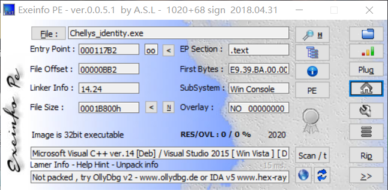
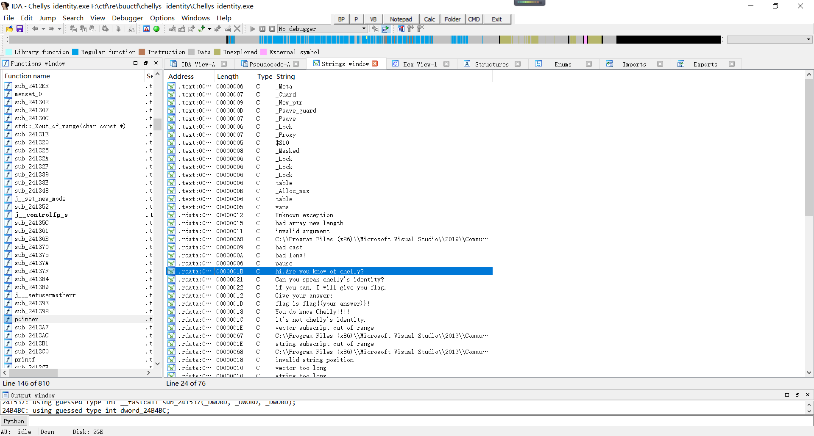
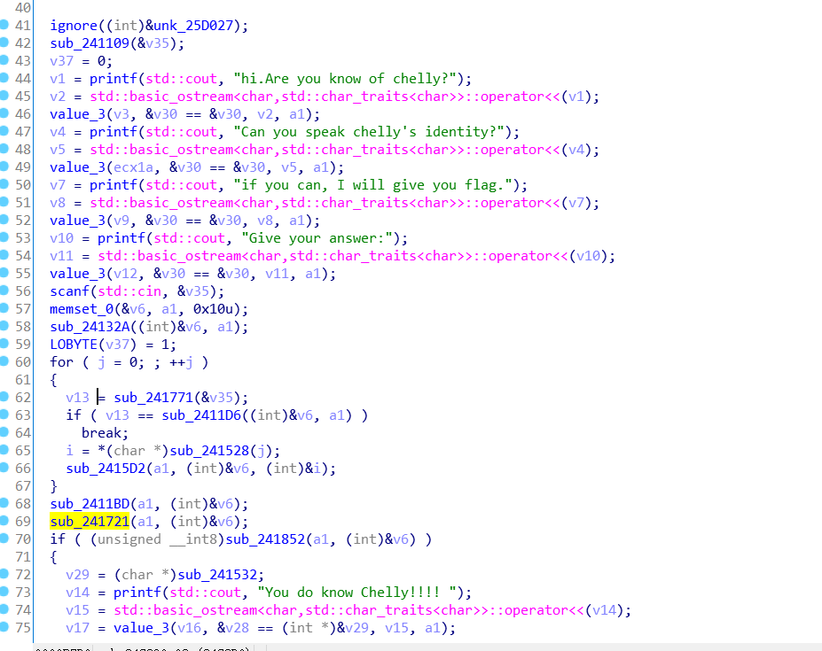
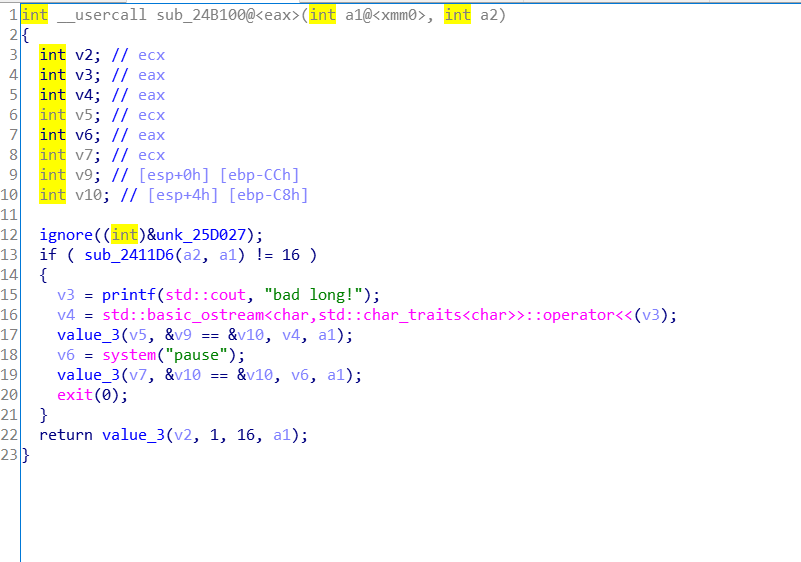
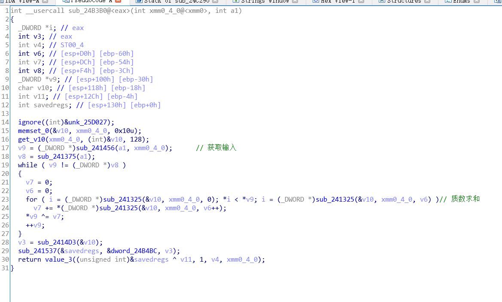
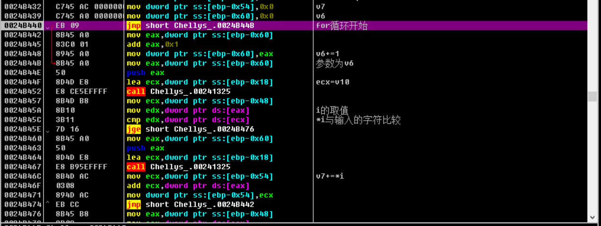
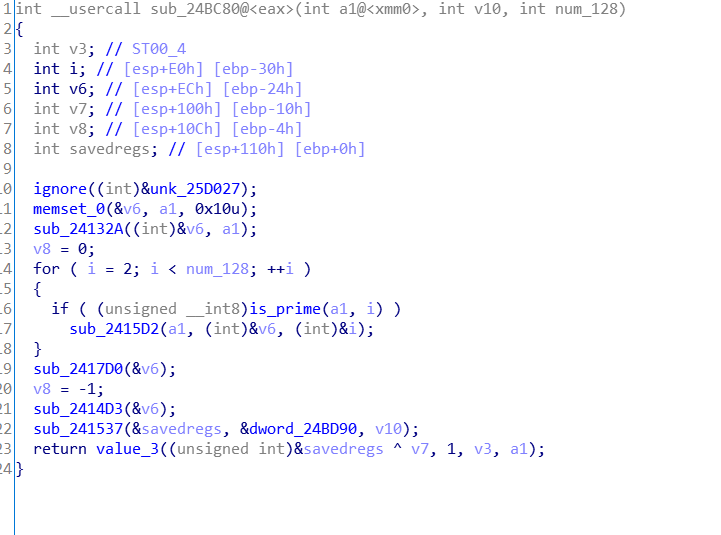

---
## gkctf chellys_identity
A.这题真是迷啊，反编译出来的c++代码一片混乱，函数多了很多奇奇怪怪的参数，还是动调大法实在
B.
拿到一个exe文件，用exeinfope查看，32位无壳


直接用IDA打开，在字符串窗口找到关键字符串


跟进找到关键函数(ignore指的是不需要分析的函数)


用c++写的代码，看起来比较乱，不过一些简单的函数还是可以直接看出来，像输出输入函数我都直接改名为printf和scanf了，关键要分析的是for循环之后的两个函数(主要是for循环我没看太懂。。)

跟进sub_2411BD,这明显是个输入长度的判断，输入要16位。那sub_2411D6就改成len函数


然后看sub_241721函数，这里的反编译c代码比较迷，边动调边分析更好理解一点


前面几个函数不好分析，先看while循环部分，里面对v9，v7有个算术运算，这里i的值和v10有关，而函数最开始有v10的初始化和赋值，而且和输入无关，可以直接通过动调得到，我们直接动调for循环里i的值

跟着循环跑几趟，可以发现i的值为2，3，5，7，11。。。明显就是质数。而且在动调的时候发现v9其实就是我们的输入。整个for循环是每次将i的值取小于当前输入字符ASCII码值的质数，并累加起来和原本的输入字符做异或。z

  知道了这部分其实已经可以猜出v10就是一个质数表，我们跟进get_v10函数查看一下可以找到判断素数的部分（光看代码还真没看出来。。。）,把sub_241325改成array以便后续分析
  
  
  
  最后再看密文比较的sub_241852函数
 ](./images/1616309847412.png)
  
  直接看if比较部分，v5是加密后的输入，array(&v31,a1,i)的值经过动调可以知道就是上面声明的一大串密文。了解这么多就可以写逆向脚本了

``` code = [438,1176,1089,377,377,1600,924,377,1610,924,637,639,376,566,836,830]
def is_prime(n):
    if(n==1):
      return 0
    for i in range(2,n):
      if(n%i==0):
        return 0
    return 1
flag=""
index=0
for s in range(16):
  for i in range(2,128):
     k=0
     d=i
     for j in range(i):
       if(is_prime(j)):
         k+=j
     d^=k
     if(d==code[index]):
       flag+=chr(i)
       index+=1
       break
print(flag)

```
最后得到flag`Che11y_1s_EG0IST`